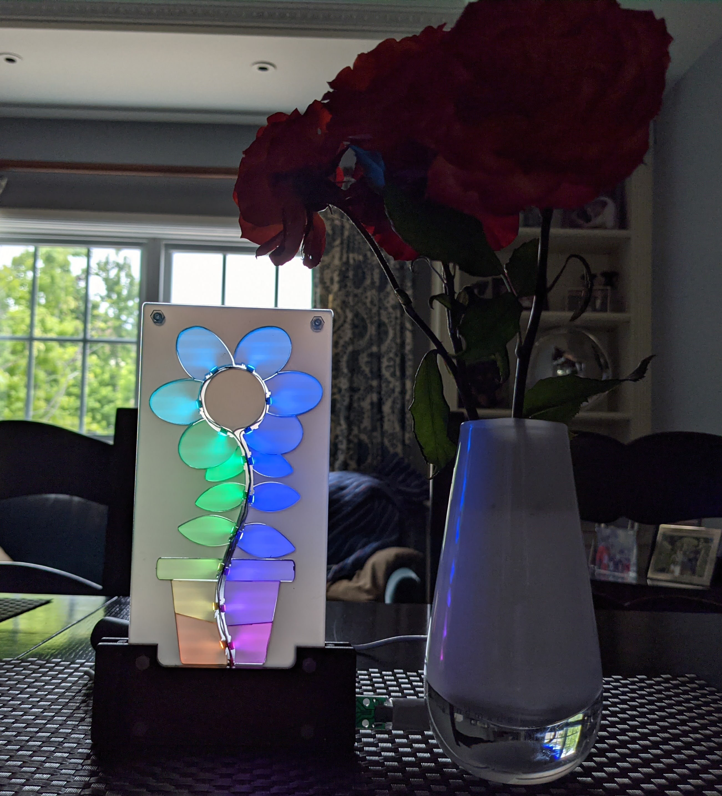

# Embedded LED Strip Flower

Design files for an edge-lit flower illuminated by an embedded LED strip.

For more information on the design and construction techniques used for this project, see <a href="https://www.youtube.com/embed/znkFRgyHzAo">this talk on creating illuminated art with embedded LED strips</a>. 

## Components
- an 18 pixel length of LED strip that has 60 LEDs/m, and is narrower than 6.4 mm (e.g. <a href="https://www.adafruit.com/product/2959">https://www.adafruit.com/product/2959</a>) preferably with white soldermask
- 1/16" (1.6mm) clear acrylic sheet
- 1/4" (6.4mm) translucent or clear acrylic sheet
- If making a frame, 1/8" (3.2mm) wood or acrylic sheet
- silver sharpie
- 4x 12mm M2 screws and nuts to hold the layers together

## Assembly Overview
Laser cut the clear and translucent acrylic sheet from the pieces in the design file.
